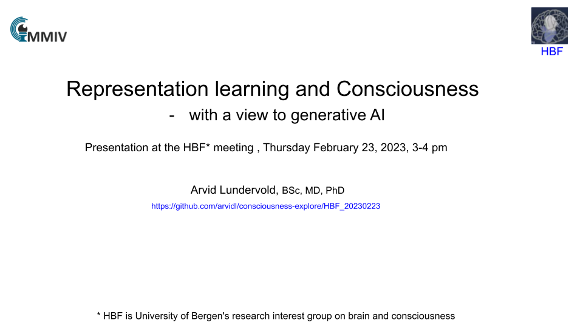

# HBF: Representation learning and attention - Consciousness and generative AI

This presentation will give a quick example-based introduction to basic ideas related to representation learning, attention, and generative models in brain and machine with possible relevance to consciousness.

## Slides

[https://github.com/arvidl/consciousness-explore/HBF_20230223](https://github.com/arvidl/consciousness-explore/HBF_20230223
)

<!-- 

Here's a short extra video that goes through a very similar notebook to the one we use in this lab: https://www.youtube.com/watch?v=OhxUgFNnj1U. You may want to watch this as well. ->

## Jupyter notebooks

:question: As Jupyter Notebook is quite new to many of you, you may want to skim through some tutorials. Here are two (also linked under "Getting Started" at MittUiB): 
* https://jupyter-notebook-beginner-guide.readthedocs.io/en/latest/index.html
* https://www.datacamp.com/community/tutorials/tutorial-jupyter-notebook

| Notebook    |      1-Click Notebook      |    Video*   |
|:----------|------|-------|
|  [ELMED219-Lab0-simple_examples.ipynb](https://nbviewer.org/github/MMIV-ML/ELMED219/blob/main/Lab0-ML/ELMED219-Lab0-simple_examples.ipynb)   constructs predictive models based on some simple data sets.  Provides a hands-on introduction to some basic ingredients and techniques in ML. |  |  |

 Note: The video walk-throughs don't always correspond precisely to the notebooks.

---

## Your turn! 

Spend some time playing around with the provided examples. You'll find some questions for you to investigate in the notebook. If you're already familiar with machine learning, you can try your hand at more advanced examples or, even better, help out other less experienced team members. Try out the things you learn in the DataCamp courses by modifying and extending the notebook used in this Lab.

-->