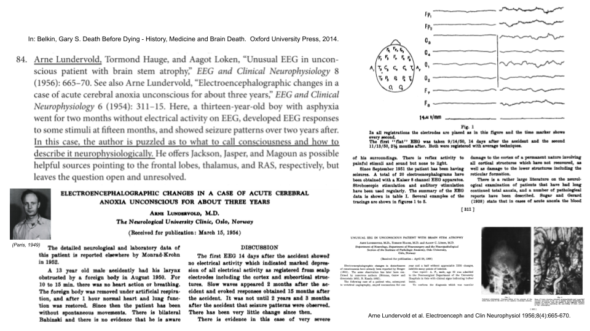

# _Consciousness explore_

**Explorations of the concept of [consciousness](https://en.wikipedia.org/wiki/Consciousness), [self-awareness](https://en.wikipedia.org/wiki/Self-awareness), and  consciousness in [brain](https://en.wikipedia.org/wiki/Neural_correlates_of_consciousness) and [machine](https://en.wikipedia.org/wiki/Artificial_consciousness)**

 
_Initiated: February 1, 2022_ (Last updated: 20220407)

**Naive credo**: (i) Make phenomena (e.g. `consciousness'), processes and values a conscious experience ("bevisstgjøre prosesser");  (ii) Representation learning, attention and relationships. [Inspired by [Gallileo's Error](https://www.philipgoffphilosophy.com/books.html), [The Conscious Prior](https://arxiv.org/abs/1709.08568), and ... [Could Machines Have It?](https://www.science.org/doi/10.1126/science.aan8871)] 

## General links:

-  Public repositories matching this topic... (https://github.com/topics/consciousness)

## Computational consciousness

### Integrated Information Theory ([IIT](https://en.wikipedia.org/wiki/Integrated_information_theory))

- Fallon, Francis. Integrated Information Theory of Consciousness. Internet Encyclopedia of Philosphy  (https://iep.utm.edu/int-info)
- Mayner, William GP, ..., [Tonini](https://en.wikipedia.org/wiki/Giulio_Tononi), Giulio. PyPhi: A toolbox for integrated information theory. PLOS Computational Biology, July 26, 2018 [[link](https://journals.plos.org/ploscompbiol/article?id=10.1371/journal.pcbi.1006343)]. Repositpry: https://github.com/wmayner/pyphi
; see also http://integratedinformationtheory.org/calculate.html and https://github.com/ELIFE-ASU/pyphi-spectrum (a wrapper for PyPhi that can be used to calculate all possible Phi values for a given subsystem)

### Consciousness and deep learning

- [Dehaene](https://no.wikipedia.org/wiki/Stanislas_Dehaene), Stanislas; Lau, Hakwan; Kouider, Sid. What is consciousness, and could machines have it? Science 2017;358(6362):486-492. [[link](https://www.science.org/doi/10.1126/science.aan8871)]
- Krauss, Patrick and Maier, Andreas. Will We Ever Have Conscious Machines? Front Comput Neurosci, December 22, 2020 [[link](https://www.frontiersin.org/articles/10.3389/fncom.2020.556544/full)]
- Langdon, Angela; Botvinick, Matthew; Nakahara, Hiroyuki et al. Meta-learning, social cognition and consciousness in brains and machines. Neural Networks 2022;145:80-89. [[link](https://www.sciencedirect.com/science/article/pii/S0893608021003956)]
- VanRullen, Rufin and Kanai, Ryota. Deep learning and the Global Workspace Theory. Trends in Neurosciences  2021;44(9):692-704. [[link](https://www.cell.com/trends/neurosciences/fulltext/S0166-2236(21)00077-1)] and at https://arxiv.org/abs/2012.10390 [[pdf](https://arxiv.org/pdf/2012.10390.pdf)]

### Disorders of consciousness

- Coma Science Group MRI pipelines: Magnetic Resonance Imagery (MRI) preprocessing and analysis pipelines and tools for the study of disorders of consciousness. (https://github.com/lrq3000/csg_mri_pipelines). See also the GIGA-Consciousness MRI Protocol (https://github.com/lrq3000/mri_protocol)

### Neuroenergetics of consiousness

- Chen, Yali and Zhang, Jun. How Energy Supports Our Brain to Yield Consciousness: Insights From Neuroimaging Based on the Neuroenergetics Hypothesis. Front Syst Neurosci 2021; 06 July [[link](https://www.frontiersin.org/articles/10.3389/fnsys.2021.648860/full)] [[pdf](https://www.frontiersin.org/articles/10.3389/fnsys.2021.648860/pdf)]
- Ito, Taku. Modeling hemodynamic response functions of the BOLD signal using Windkessel-Balloon model (https://github.com/ito-takuya/HemodynamicResponseModeling). Based on Friston, Karl J; Harrison, L; Penny W. Dynamic causal modeling. Neuroimage 2003;19(4):1273-12302  [[link](https://pubmed.ncbi.nlm.nih.gov/12948688)] [[pdf](https://www.fil.ion.ucl.ac.uk/~karl/Dynamic%20causal%20modelling.pdf)]

## Esoteric

### [Hyphal](https://en.wikipedia.org/wiki/Hypha) and [mycelial](https://en.wikipedia.org/wiki/Mycelium) consciousness

- Money, Nicholas P. Hyphal and mycelial consciousness: the concept of the fungal mind. Fungal Biology 2021;125(4):257-259 [[link](https://www.sciencedirect.com/science/article/pii/S1878614621000246)]

- Jabr, Ferris. The Social Life of Forests: Trees appear to communicate and cooperate through subterranean networks of fungi. What are they sharing with one another? The New York Times Magazine, December 2, 2020  [[link](https://www.nytimes.com/interactive/2020/12/02/magazine/tree-communication-mycorrhiza.html)]

### Orchestrated objective reduction ([Orch OR](https://en.wikipedia.org/wiki/Orchestrated_objective_reduction))

- [Penrose](https://en.wikipedia.org/wiki/Roger_Penrose), Roger. Shadows of the Mind: A Search for the Missing Science of Consciousness. Oxford University Press, 1994. See [[here](https://en.wikipedia.org/wiki/Shadows_of_the_Mind)] and [[here](https://www.youtube.com/watch?v=Co8v5-0znf0)]

### Fractals 
 - https://en.wikipedia.org/wiki/Fractal
 - Luppia AI, Craiga MM, Coppolaa P et al. Preserved fractal character of structural brain networks is associated with covert consciousness after severe brain injury. NeuroImage: Clinical 2021;30:102682 [[link](https://www.sciencedirect.com/science/article/pii/S2213158221001261)]  (using [box-counting](https://en.wikipedia.org/wiki/Box_counting)  [[code for 3D](https://github.com/ChatzigeorgiouGroup/FractalDimension)])

### Building artificial neurons with mathematics
- Kanari, Lida; ...; [Markram](https://en.wikipedia.org/wiki/Henry_Markram), Henry. Computational synthesis of cortical dendritic morphologies. Cell Reports 2022;39(1):110586 [[link](https://www.cell.com/cell-reports/fulltext/S2211-1247(22)00330-8)]. Code repository for the topological neuron synthesis algorithm [[NeuroTS](https://github.com/BlueBrain/NeuroTS)]

## Relevant books

- [Chalmers](https://en.wikipedia.org/wiki/David_Chalmers), David. Reality+:  Virtual worlds and the problems of philosophy. Norton & Comp., 2022.  See also http://consc.net/reality 
- [Ginsburg](https://mitpress.mit.edu/contributors/simona-ginsburg), Simona and [Jablonka](https://en.wikipedia.org/wiki/Eva_Jablonka), Eva. [Picturing the Mind](https://mitpress.mit.edu/books/picturing-mind): Consciousness through the Lens of Evolution. MIT Press, 2022. See also [[The origin of consciousness](https://iai.tv/articles/the-origin-of-consciousness-auid-1865)]
- [Goff](https://en.wikipedia.org/wiki/Philip_Goff_(philosopher)), Philip. Gallileo's Error: Foundations for a New Science of Consciousness. Pantheon 2019 [[philsophynow](https://philosophynow.org/issues/135/Galileos_Error_by_Philip_Goff) "... a defence of [panpsychism](https://en.wikipedia.org/wiki/Panpsychism)"] [[book homepage](https://www.philipgoffphilosophy.com/books.html)]
- [Grossberg](https://en.wikipedia.org/wiki/Stephen_Grossberg), Stephen. Conscious Mind, Resonant Brain: How Each Brain Makes a Mind. Oxford University Press, 2021. [[link](https://oxford.universitypressscholarship.com/view/10.1093/oso/9780190070557.001.0001/oso-9780190070557)]  Grossberg is developer (togeter with [Gail Carpenter](https://en.wikipedia.org/wiki/Gail_Carpenter)) of Adaptive Resonance Theory ([ART](https://en.wikipedia.org/wiki/Adaptive_resonance_theory)).
- [Hawkins](https://en.wikipedia.org/wiki/Jeff_Hawkins), Jeff. A Thousand Brains: A New Theory of Intelligence. Basic Books, 2021.   See also [GatesNotes](https://www.gatesnotes.com/Books/A-Thousand-Brains) and [Numenta](https://numenta.com/a-thousand-brains-by-jeff-hawkins)
- [Russell](https://en.wikipedia.org/wiki/Bertrand_Russell), Bertrand. The Analysis of Mind. London: George Allen & Unwin, 1921  (The Project Gutenberg [EBook](https://www.gutenberg.org/files/2529/2529-h/2529-h.htm); [audiobook](https://www.youtube.com/watch?v=MhZzO35sQio)).
- [Schrödinger](https://en.wikipedia.org/wiki/Erwin_Schr%C3%B6dinger), Erwin. Mind and Matter. [Tarner Lectures](https://en.wikipedia.org/wiki/Tarner_Lectures), Trinity College, Cambridge, Cambridge University Press, 1958.  [[CUP link](https://www.cambridge.org/core/books/abs/what-is-life/physical-basis-of-consciousness/903D93DC7860EDBD16A67C17E8470544)]
- [Seth](https://en.wikipedia.org/wiki/Anil_Seth), Anil. Being You: A New Science of Consciousness. Faber, 2021. See also Azeem Azhar' Exponential View Podcast "What Studying Consciousness Can Reveal about AI and the Metaverse" (with Anil Seth) [[here](https://hbr.org/2019/04/podcast-exponential-view)]

## Relevant videos

- Chalmers, David. "The Hard Problem of Consciousness", Jan 29, 2020; Lex Fridman Podcast #69 (https://www.youtube.com/watch?v=LW59lMvxmY4)
- Chalmers, David. "The Meaning of Life in the Metaverse", Mar 23, 2022; Azeem Azhar's Exponetial View Podcast (https://hbr.org/podcast/2022/03/the-meaning-of-life-in-the-metaverse-with-david-chalmers)
- Ginsburg, Simona. "Animal consciousness: a philosophical and evolutionary approach"; Human Brains: Conversations #6, [humanbrains.fondazioneprada.org](https://humanbrains.fondazioneprada.org/en) Mar 16, 2022  (https://www.youtube.com/watch?v=YqMHUT5v_HU)
- Jablonka, Eva. "Learning and the origins of consciousness"; Human Brains: Conversations #6, [humanbrains.fondazioneprada.org](https://humanbrains.fondazioneprada.org/en) Mar 16, 202 (https://www.youtube.com/watch?v=fGeASWjdqjw)
- Penrose, Roger & Hameroff, Stuart. "Consciousness and the Physics of the Brain", The Qualcomm Institute, La Jolla, CA, Jan 10, 2020 (https://www.youtube.com/watch?v=xGbgDf4HCHU)
- Seth, Anil. "Consciousness: Neuroscience, Perception and Hallucination", Dec 17, 2021 (https://www.youtube.com/watch?v=cCyapf0E5ns)
- Seth, Anil. "What Studying Consciousness Can Reveal about AI and the Metaverse", Jan 26, 2022; Azeem Azhar's Exponetial View Podcast (https://hbr.org/podcast/2022/01/what-studying-consciousness-can-reveal-about-ai-and-the-metaverse-with-anil-seth)
- [Bengio](https://en.wikipedia.org/wiki/Yoshua_Bengio), Yoshua. "From Deep Learning to Consciousness", Jan 6, 2020; NeurIPS 2019 Robin.ly Interview (https://www.youtube.com/watch?v=lat0jSpNQoM)

## Relevant podcasts

- [Goff](https://www.philipgoffphilosophy.com), Philip &  [Frankish](https://www.keithfrankish.com), Keith: "Mind Chat" (https://www.youtube.com/c/MindChat). See also [[here](https://philosophybreak.com/articles/mind-chat-philip-goff-keith-frankish-why-we-are-conscious)].

## Relevant fora

- **HBF Brain and Consciousness** (HBF is University of Bergen's research interest group on brain and consciousness) - https://padlet.com/magdadumitru/427b4m9by7e00tpl
- The Science of Consciousness (**TSC**) Conferences (since 1994) -  https://consciousness.arizona.edu/science-consciousness-conferences-1994

## Misc.

- Ito, Takuya; Yang, Guangyu R; Laurent, Patryk; Schultz, Douglas H; Cole, Michael W. Constructing neural network models from brain data reveals representational transformations linked to adaptive behavior. Nature Communications 2022;13:673 [[link](https://www.nature.com/articles/s41467-022-28323-7)] [[code](https://github.com/ito-takuya/sr_enn)] [[data](https://openneuro.org/datasets/ds003701/versions/1.0.1) in BIDS]
- Lundervold, Arne [[pic](https://collections.nlm.nih.gov/catalog/nlm:nlmuid-101422162-img)]. Electroencephalographic changes in a case of acute cerebral anoxia unconscious for about three years. Electroencephalogr Clin Neurophysiol 1954;6(2):311-315. [[link](https://www.sciencedirect.com/science/article/abs/pii/0013469454900346?via%3Dihub)] [[first page](https://www.sciencedirect.com/sdfe/pdf/download/eid/1-s2.0-0013469454900346/first-page-pdf)] 
     
- Lundervold, Arvid. On consciousness, resting state fMRI, and neurodynamics. Nonlinear Biomedical Physics 2010;4(S9) [[link](https://nonlinearbiomedphys.biomedcentral.com/articles/10.1186/1753-4631-4-S1-S9)]
- Lundervold, Alexander S and Lundervold, Arvid. An overview of deep learning in medical imaging focusing on MRI. Zeitschrift fur Medizinische Physik 2019;29(2):102-127. [[link](https://www.sciencedirect.com/science/article/pii/S0939388918301181)]  See also https://www.dgmp.de/de-DE/307/autorenpreis-der-zmp
- Lundervold, Arvid. Elements of consciousness - some eclectic perspectives. [HBF](https://padlet.com/magdadumitru/427b4m9by7e00tpl) seminar, March 24, 2022  [[link to slides](https://docs.google.com/presentation/d/e/2PACX-1vTvLfxaHHsnOLUBGkaoLNMvAhtMdHCUYkaTTq-4yKD1LtOGvOoewnWiY8Ub6o4trVWeend1ghVZlzBn/pub?start=false&loop=false&delayms=3000)]

## Topics with code 
(and source of origin)

- **Hemodynamic Response Modeling**  [[link](./code/HemodynamicResponseModeling)]. Wu et al. [rsHRF](https://github.com/compneuro-da/rsHRF) toolbox. Neuroimage 2021 [[paper](https://www.sciencedirect.com/science/article/pii/S1053811921008648)]
- **[PyPhi](https://github.com/wmayner/pyphi) (library for computing integrated information (𝚽), and the associated quantities and objects)** exploration [[link](./code/PyPhi)]
- **[NeuroTS](https://github.com/BlueBrain/NeuroTS)  (Computational generation of artificial neuronal trees based on the topology of reconstructed cells and their statistical properties) [[link](./code/NeuroTS)]
