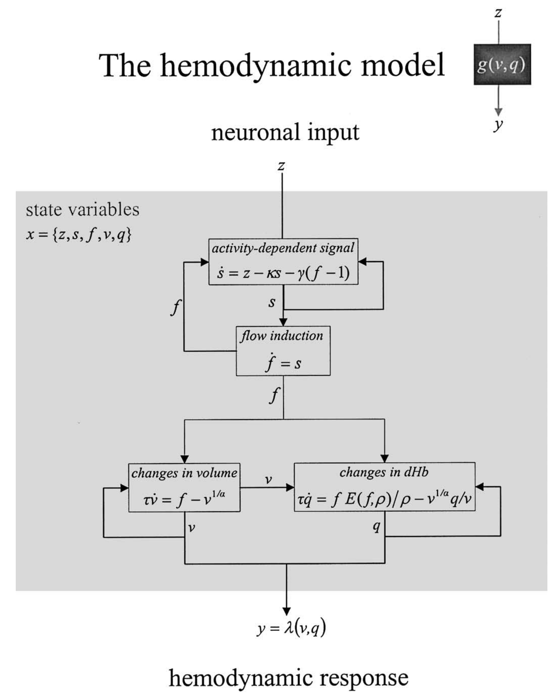

# HemodynamicResponseModeling

(From: Takuya Ito's https://github.com/ito-takuya/HemodynamicResponseModeling
modeling hemodynamic response functions of the BOLD signal using Windkessel-Balloon model)

Based on Friston KJ, Harrison L, Penny W. Dynamic causal modelling. Neuroimage 2003;19:1273–1302.


### Hemodynamic state equations

The remaining state variables of each region are biophysical states engendering the BOLD signal and mediate the
translation of neuronal activity into hemodynamic responses. Hemodynamic states are a function of, and only of,
the neuronal state of each region. These equations have been described elsewhere (Friston et al., 2000) and constitute a
hemodynamic model that embeds the _Balloon–Windkessel model_ (Buxton et al., 1998; Mandeville et al., 1999).




#### Takuya Ito implementation of Friston KJ et al. Dynamic causal modelling. Neuroimage 2003;19:1273-1302.
```
def balloonWindkessel(z, sampling_rate, alpha=0.32, kappa=0.65, gamma=0.41, tau=0.98, rho=0.34, V0=0.02):
    """
    Computes the Balloon-Windkessel transformed BOLD signal
    Numerical method (for integration): Runge-Kutta 2nd order method (RK2)

    z:          Measure of neuronal activity (space x time 2d array, or 1d time array)
    sampling_rate: sampling rate, or time step (in seconds)
    alpha:      Grubb's exponent
    kappa:      Rate of signal decay (in seconds)
    gamma:      Rate of flow-dependent estimation (in seconds)
    tau:        Hemodynamic transit time (in seconds)
    rho:        Resting oxygen extraction fraction
    V0:         resting blood vlume fraction

    RETURNS:
    BOLD:       The transformed BOLD signal (from neural/synaptic activity)
    s:          Vasodilatory signal
    f:          blood inflow
    v:          blood volume
    q:          deoxyhemoglobin content
    """
```


## Nilearn: Example of hemodynamic response functions.

The HRF is the filter that couples neural responses to the metabolic-related changes in the MRI signal. HRF models are simply phenomenological.
- https://nilearn.github.io/auto_examples/04_glm_first_level/plot_hrf.html

## rsHRF: A toolbox for resting-state HRF estimation and deconvolution

- Guo-Rong Wu, Nigel Colenbier, Sofie Van Den Bossche, Kenzo Clauw, Amogh Johri, Madhur Tandon, Daniele Marinazzo. “rsHRF: A Toolbox for Resting-State HRF Estimation and Deconvolution.” Neuroimage, 2021, 244: 118591. [[link](https://www.sciencedirect.com/science/article/pii/S1053811921008648)]


- http://bids-apps.neuroimaging.io/rsHRF
>Resting state HRF estimation from BOLD-fMRI signal. This toolbox is aimed to retrieve the onsets of pseudo-events triggering an hemodynamic response from resting state fMRI BOLD voxel-wise signal. It is based on [point process](https://en.wikipedia.org/wiki/Point_process) theory, and fits a model to retrieve the optimal lag between the events and the HRF onset, as well as the HRF shape, using either the canonical shape with two derivatives, or a (smoothed) Finite Impulse Response.
>
>Once that the HRF has been retrieved for each voxel, it can be deconvolved from the time series (for example to improve lag-based connectivity estimates), or one can map the shape parameters everywhere in the brain (including white matter), and use the shape as a pathophysiological indicator.


